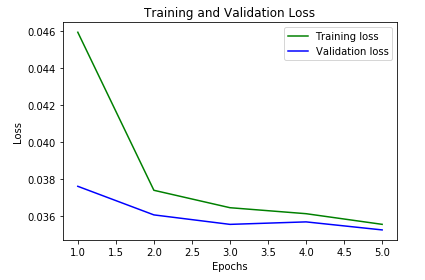
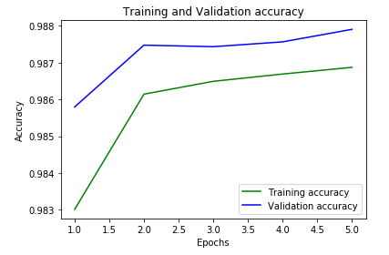

# DESIGN AND IMPLEMENTATION OF A BUILDING COLLAPSE PREDICTION MOBILE APPLICATION  
*Case Study: Lagos State*

## Context
Buildings are essential as safe shelters for people, belongings, and daily living. To achieve safety and durability, proper planning, design, and construction are required, while considering environmental and structural factors.  

In Lagos State, Nigeria, building collapses have been on the rise in recent years, leading to significant loss of lives and property. This project addresses this critical issue by designing a predictive mobile application for early detection of potential building collapse.

---

## Objectives
1. Collect historical building collapse data in Lagos State (2010–2020).  
2. Obtain expert data on collapse tendencies and use it for evaluation of structural fitness.  
3. Extract common properties from expert data and validate them against historical records.  
4. Design and evaluate a prediction mobile application that uses this data for building collapse prediction.  

---

## Methods

- **Data Collection**  
  - Compiled a dataset of over **1 million entries**, including historical building collapse records (2010–2020) and expert-based assessments.  

- **Data Pre-processing & Feature Engineering**  
  - Cleaned, normalized, and extracted key features from raw data.  
  - Selected relevant attributes for training based on expert input and historical validation.  

- **Model Development & Evaluation**  
  - Developed a **supervised machine learning model** in **Python** using Anaconda libraries.  
  - Trained on 80% of the dataset and tested with the remaining 20%.  
  - Exported the trained model to a **TensorFlow Lite (.tflite)** file for deployment.  

- **Mobile Application Development**  
  - Built an **Android application** in **Java (Android Studio)** and integrated the trained ML model for real-time predictions.  

- **UI/UX Design**  
  - Created an intuitive interface prototype in **Figma**, then converted to XML for compatibility with Android Studio.  

---

## Results
- Achieved **98.86% prediction accuracy** on unseen test data.  
- Model correctly predicts ~98 out of 100 building cases.  
- Training and validation results show:  
  - Convergence in **loss function** during training.  
  - High and stable **accuracy** across both training and validation sets.  

-   
-   

---

## Technologies Used
- **Python** (TensorFlow, Pandas, NumPy)  
- **TensorFlow Lite (tflite)** for deployment  
- **Figma** for UI design  
- **Android Studio (Java)** for mobile app development

---

## Key Insights & Conclusion
- The model demonstrates strong potential for real-world deployment, with very high accuracy.  
- Adoption of this predictive application could significantly raise public awareness of building collapse risks in Lagos State.  
- The solution can encourage **predictive maintenance**, saving time, money, property, and most importantly, **lives**.  
- This approach shows how **AI and mobile applications** can address urban safety challenges in developing regions.  

---

## Citation
If you use or refer to this work, please cite:  
> *Gureje G.E., "Design and Implementation of a Building Collapse Prediction Mobile Application: A Case Study of Lagos State." University of Lagos, 2021.*
